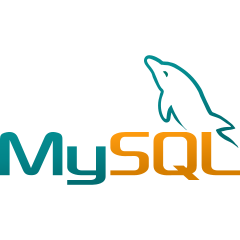

<h2 align="center">
    Heyo, I'm Lorry Afriyie!
    
</h2>

**`Full Stack Developer`**

---
 

    

        I'm a full-stack web developer. Using my skills to be able to create applications from whatever idea that may come to mind is what makes 
        being a developer exciting!, and being exposed new tech that improves not only the skills but the application being developed.
    

    

        Being able to instruct a computer on what to do is such an awesome experience, with this ability, I use it to create applications that are meaningful not just for me but to whoever needs it. 
        With this ability, there are no limits as long as I learn and grow in the coding space.
    

    

        Gaming and photo editing are my hobbies since there is so much creativity that go into these arts, 
        oh and there's no way I can forget about learning about the cool new 
        of tech whether it may be software or hardware related.
    

     

---

    <h3>🧰 Languages and Tools</h3>
    

        
        
        
        
        
        
        
        
        
        
        
        
        
        
        
        
    

     

 

---

    <h3>Currently Learning</h3>
    

        
        
        
    

      

<!--
Here are some ideas to get you started:
- 🔭 I’m currently working on ...
- 🌱 I’m currently learning ...
- 👯 I’m looking to collaborate on ...
- 🤔 I’m looking for help with ...
- 💬 Ask me about ...
- 📫 How to reach me: ...
- 😄 Pronouns: ...
- ⚡ Fun fact: ...
-->

<!---
LorryAfriyie/LorryAfriyie is a ✨ special ✨ repository because its `README.md` (this file) appears on your GitHub profile.
You can click the Preview link to take a look at your changes.
--->
